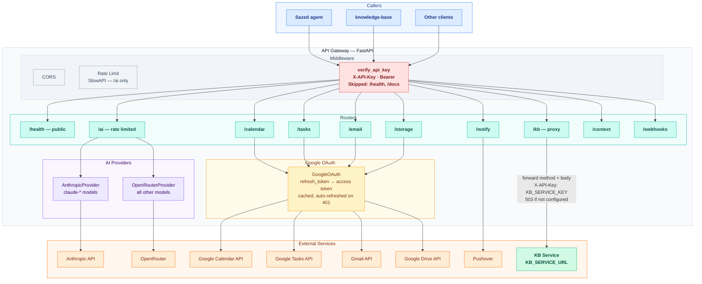

# API Gateway — Architecture

Central BFF: auth, rate limiting, routing to Google APIs, AI providers, and KB service proxy.

**Color key:** 🔵 Callers &nbsp;|&nbsp; 🔴 Auth &nbsp;|&nbsp; 🟢 Routers &nbsp;|&nbsp; 🟣 AI Providers &nbsp;|&nbsp; 🟡 Google OAuth &nbsp;|&nbsp; 🟠 External Services &nbsp;|&nbsp; ◼ KB proxy

---

### Request flow

| Route | Behavior |
|---|---|
| `GET /health` | Always public — no auth required |
| `POST /ai/*` | Model routing: `claude-*` → Anthropic or OpenRouter fallback; all others → OpenRouter. Rate-limited per IP via SlowAPI. |
| `/calendar` `/tasks` `/email` `/storage` | `GoogleOAuth.refresh_token()` → cached access token; call respective Google API. Token auto-refreshed on 401. |
| `/kb/*` | Transparent proxy: forward method, path, query params, body to `KB_SERVICE_URL/v1{path}`. 503 if `KB_SERVICE_URL` not set, 504 on timeout. |
| `/notify` | Pushover push notification via API token + user key. |
