# API Gateway — Detailed Architecture

Specific structure: entry point, config, auth, and each router’s responsibilities and downstream calls.

```mermaid
flowchart TB
    subgraph Entry["Entry & Config"]
        Main["app/main.py\nFastAPI app, CORS, rate limit on AI"]
        Config["app/config.py\nSettings (pydantic-settings)\nAPI_KEY, Google, Pushover, AI, KB_SERVICE_*"]
        Deps["app/dependencies.py\nverify_api_key\nX-API-Key or Bearer"]
    end

    subgraph Auth["Google OAuth"]
        GoogleAuth["app/auth/google.py\nGoogleOAuth, refresh_token"]
        TokenCache["Module-level _cached_token\nRouters refresh on 401"]
    end

    subgraph Routers["Routers"]
        Health["health.py\nGET /health (public)"]
        Notify["notify.py\nPOST /notify → Pushover"]
        AI["ai.py\n/ai/v1/chat/completions, /models\nBaseProvider → Anthropic | OpenRouter\nRate limit 60/min"]
        Calendar["calendar.py\n/today, /events, /availability\nPOST/PATCH/DELETE /events"]
        Tasks["tasks.py\n/upcoming, /lists, /lists/{id}/tasks\nCRUD via path_params"]
        Email["email.py\n/recent, /unread, /search, /messages/{id}\nPOST /draft"]
        Storage["storage.py\nGET /files, GET /files/{id}/content\n_KB_SUBFOLDERS: general, projects, purdue, career, reference"]
        KB["kb.py\nProxy: /search, /sync, /sources, /files, /stats\nDELETE /files/{id}, DELETE /kb\n→ KB_SERVICE_URL/v1{path}"]
        Context["context.py\n(stub)"]
        Webhooks["webhooks.py\n(stub)"]
    end

    subgraph External["Downstream"]
        Drive["Google Drive API\nfiles, export"]
        Gmail["Gmail API"]
        CalAPI["Calendar API"]
        TasksAPI["Tasks API"]
        Pushover["Pushover API"]
        KBService["KB service\nPOST/GET/DELETE"]
        Anth["Anthropic API"]
        OpenRouter["OpenRouter API"]
    end

    Main --> Config
    Main --> Deps
    Main --> Routers
    Calendar --> GoogleAuth
    Tasks --> GoogleAuth
    Email --> GoogleAuth
    Storage --> GoogleAuth
    Storage --> Drive
    Email --> Gmail
    Calendar --> CalAPI
    Tasks --> TasksAPI
    Notify --> Pushover
    KB --> KBService
    AI --> Anth
    AI --> OpenRouter
```

**Key files:**

| Area        | File / path              | Purpose |
|------------|---------------------------|---------|
| Entry      | `app/main.py`             | App creation, middleware, router mounts |
| Config     | `app/config.py`           | Env-based settings |
| Auth       | `app/dependencies.py`    | API key check (optional if unset) |
| Google     | `app/auth/google.py`     | OAuth refresh; used by calendar, tasks, email, storage |
| AI         | `app/providers/*.py`      | BaseProvider, Anthropic, OpenRouter |
| KB proxy   | `app/routers/kb.py`       | Forwards /kb/* to KB service with timeout 120s |
