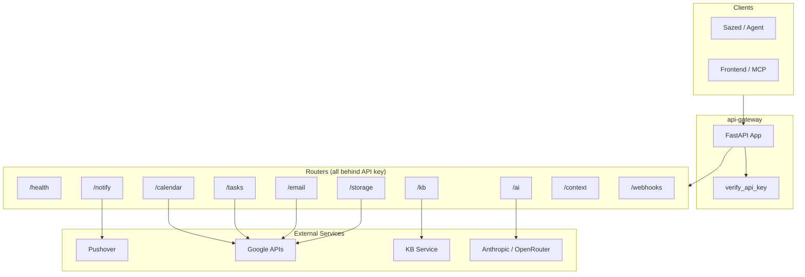

# API Gateway — Architecture Overview

High-level view for quickly understanding the codebase.

**In one sentence:** Single FastAPI app that fronts Google (Calendar, Tasks, Email, Drive), Pushover, AI providers, and the KB service behind one URL and one API key.
